<div align="center">

# 🔍 OSINT-Nexus

### *Next-Generation Open Source Intelligence Platform*

**Combining the power of passive reconnaissance with AI-driven analysis and stunning visual link exploration**

[](https://python.org)
[](https://www.riverbankcomputing.com/software/pyqt/)
[](https://ai.google.dev/)
[](https://networkx.org/)
[](LICENSE)
[](https://github.com/Muhib-Mehdi/OSINT-NEXUS)

[](https://github.com/Muhib-Mehdi/OSINT-NEXUS)
[](https://www.buymeacoffee.com/Muhib--Mehdi)

---

[**Features**](#-features) • [**Installation**](#-installation) • [**Screenshots**](#-screenshots) • [**Usage**](#-usage) • [**Architecture**](#-architecture) • [**Contributing**](#-contributing)

</div>

---

## 📋 Table of Contents

- [Overview](#-overview)
- [Why OSINT-Nexus?](#-why-osint-nexus)
- [Features](#-features)
- [Screenshots](#-screenshots)
- [Installation](#-installation)
- [Usage](#-usage)
- [Architecture](#-architecture)
- [System Design Diagrams](#-system-design-diagrams)
- [OSINT Modules](#-osint-modules)
- [AI-Powered Features](#-ai-powered-features)
- [Graph Analytics](#-graph-analytics)
- [Configuration](#%EF%B8%8F-configuration)
- [Report Generation](#-report-generation)
- [Keyboard Shortcuts](#%EF%B8%8F-keyboard-shortcuts)
- [Contributing](#-contributing)
- [License & Contact](#-license--contact)

---

## 🎯 Overview

**OSINT-Nexus** is a powerful, cross-platform Open Source Intelligence (OSINT) gathering and visualization application. It combines the passive reconnaissance capabilities of tools like **TheHarvester** and **SpiderFoot** with the powerful visual link analysis of **Maltego** — enhanced with **AI-powered analysis** using Google Gemini and **advanced graph analytics** using cutting-edge algorithms.

> 💡 **Built for security researchers, penetration testers, and intelligence analysts who need comprehensive, actionable insights from public data.**

---

## 🏆 Why OSINT-Nexus?

<table>
<tr>
<th>Feature</th>
<th>OSINT-Nexus</th>
<th>Maltego</th>
<th>SpiderFoot</th>
<th>TheHarvester</th>
</tr>
<tr>
<td><strong>Interactive Graph Visualization</strong></td>
<td>✅ Force-directed</td>
<td>✅ Commercial</td>
<td>❌ Basic</td>
<td>❌ None</td>
</tr>
<tr>
<td><strong>AI-Powered Analysis</strong></td>
<td>✅ Gemini Integration</td>
<td>❌ None</td>
<td>❌ None</td>
<td>❌ None</td>
</tr>
<tr>
<td><strong>Graph Analytics (PageRank, Louvain)</strong></td>
<td>✅ Built-in</td>
<td>❌ None</td>
<td>❌ None</td>
<td>❌ None</td>
</tr>
<tr>
<td><strong>Breach Intelligence</strong></td>
<td>✅ HaveIBeenPwned</td>
<td>💰 Paid Add-on</td>
<td>✅ Basic</td>
<td>❌ None</td>
</tr>
<tr>
<td><strong>Professional Reporting</strong></td>
<td>✅ HTML/PDF/STIX</td>
<td>✅ PDF</td>
<td>✅ HTML</td>
<td>❌ None</td>
</tr>
<tr>
<td><strong>Cross-Platform</strong></td>
<td>✅ Windows/Linux</td>
<td>✅ All</td>
<td>✅ Web-based</td>
<td>✅ CLI</td>
</tr>
<tr>
<td><strong>Open Source</strong></td>
<td>✅ MIT License</td>
<td>❌ Proprietary</td>
<td>✅ MIT</td>
<td>✅ GPL</td>
</tr>
<tr>
<td><strong>Price</strong></td>
<td>🆓 Free</td>
<td>💰 $999+/year</td>
<td>🆓 Free</td>
<td>🆓 Free</td>
</tr>
</table>

---

## ✨ Features

### 🔍 Intelligence Gathering

| Module | Capabilities | Input Types |
|--------|-------------|-------------|
| **Email Harvester** | Discover emails, names, subdomains | Domain |
| **Social Profiler** | Find social media accounts | Username, Email |
| **Phone Recon** | Carrier, location, line type | Phone Number |
| **Domain Infrastructure** | WHOIS, DNS, MX, NS records | Domain, IP |
| **GitHub Recon** | Repos, commits, collaborators | Username |
| **Breach Intelligence** | Password exposure, breach history | Email, Domain |
| **Image Forensics** | EXIF metadata, GPS extraction | Domain, URL |

### 🤖 AI-Powered Analysis

- **Entity Correlation** - Automatically discover hidden relationships
- **Threat Assessment** - AI-generated risk scores and narratives
- **Natural Language Queries** - Ask questions in plain English
- **Executive Summaries** - Auto-generate professional reports

### 📊 Advanced Analytics

- **Community Detection** - Louvain algorithm for clustering
- **Centrality Analysis** - PageRank, betweenness, closeness
- **Anomaly Detection** - Statistical outlier identification
- **Path Finding** - Shortest paths between entities

### 📄 Professional Reporting

- **HTML Reports** - Beautiful, dark-themed interactive reports
- **PDF Reports** - Print-ready professional documents
- **STIX 2.1 Export** - CTI standard for threat sharing

---

## 📸 Screenshots

<div align="center">

### Target Scan Interface
*Configure your OSINT scan parameters with an intuitive dark-mode interface*


---

### Interactive Graph Visualization
*Explore entity relationships with force-directed graph layout and real-time analysis*


</div>

---

## 🚀 Installation

### Prerequisites

| Requirement | Version | Purpose |
|-------------|---------|---------|
| Python | 3.10+ | Runtime |
| pip | Latest | Package manager |
| Git | Any | Clone repository |
| Gemini API Key | Optional | AI features |
| HIBP API Key | Optional | Breach intelligence |

### Quick Start

```bash
# Clone the repository
git clone https://github.com/Muhib-Mehdi/OSINT-NEXUS.git
cd OSINT-NEXUS

# Create virtual environment
python -m venv venv

# Activate virtual environment
# Windows:
.\venv\Scripts\activate
# Linux/Mac:
source venv/bin/activate

# Install dependencies
pip install -r requirements.txt

# Run the application
python src/main.py
```

<details>
<summary>📦 <strong>Building Standalone Executable</strong></summary>

### Windows

```powershell
# Install PyInstaller
pip install pyinstaller

# Build executable
pyinstaller build.spec

# The executable will be in dist/OSINT-Nexus/
```

### Linux

```bash
# Install PyInstaller
pip install pyinstaller

# Build executable
pyinstaller build.spec

# Run installer (optional)
sudo ./installers/installer_linux.sh
```

</details>

---

## 📖 Usage

### Workflow Overview

```mermaid
flowchart LR
    A[🎯 Enter Target] --> B[📡 Select Modules]
    B --> C[🚀 Run Scan]
    C --> D[🔗 View Graph]
    D --> E[🤖 AI Analysis]
    E --> F[📄 Export Report]
    
    style A fill:#58a6ff,color:#fff
    style B fill:#3fb950,color:#fff
    style C fill:#f0883e,color:#fff
    style D fill:#a371f7,color:#fff
    style E fill:#db61a2,color:#fff
    style F fill:#79c0ff,color:#fff
```



### Step-by-Step Guide

1. **Create/Open Project**
   - `File → New Project` or `Ctrl+N`
   - Enter project name and description

2. **Configure Target**
   - Select target type (Username, Domain, Email, IP, Phone)
   - Enter target value
   - Choose data sources (Google, GitHub, Shodan, etc.)

3. **Run Scan**
   - Click `🚀 Run Full Scan`
   - Monitor progress in the log panel
   - Modules run in parallel for speed

4. **Explore Results**
   - Switch to `Graph View` tab
   - Click nodes to inspect entities
   - Right-click for transforms and actions

5. **Analyze with AI**
   - Configure Gemini API in Settings
   - Use natural language queries
   - Generate threat assessments

6. **Export Report**
   - `File → Export → HTML/PDF/STIX`
   - Professional reports ready for sharing

---

## 🏗️ Architecture


## 📐 System Design Diagrams

To better understand the internal workings of OSINT-Nexus, here are some additional architectural diagrams.

### 🔄 Data Flow Sequence

This sequence diagram illustrates how data flows from the user input through the system components during a scan operation.


### 🧩 Class Structure

A high-level view of the core class relationships and inheritance hierarchy.


### 🚦 Scan Lifecycle State Machine

The states a scan operation goes through from initiation to completion.


---

## 🔌 OSINT Modules

<details>
<summary><strong>📧 Email Harvester</strong></summary>

Discovers emails, names, and subdomains from target domains.

**Input:** Domain  
**Output:** Emails, Names, Subdomains  
**Sources:** Google, Bing, DuckDuckGo, LinkedIn

</details>

<details>
<summary><strong>👤 Social Profile Lookup</strong></summary>

Finds social media profiles across 300+ platforms.

**Input:** Username, Email  
**Output:** Social profiles, Account URLs  
**Platforms:** Twitter, Instagram, GitHub, LinkedIn, Reddit, etc.

</details>

<details>
<summary><strong>📱 Phone Recon</strong></summary>

Extracts carrier and location information from phone numbers.

**Input:** Phone Number  
**Output:** Carrier, Country, Line Type, Valid Status

</details>

<details>
<summary><strong>🌐 Domain Infrastructure</strong></summary>

Comprehensive domain and IP reconnaissance.

**Input:** Domain, IP  
**Output:** WHOIS, DNS records, MX, NS, Subdomains

</details>

<details>
<summary><strong>🔓 Breach Intelligence</strong></summary>

Checks emails against known data breaches.

**Input:** Email, Domain  
**Output:** Breach records, Exposure dates, Compromised data types  
**API:** HaveIBeenPwned

</details>

<details>
<summary><strong>📷 Image Forensics</strong></summary>

Extracts hidden metadata from images.

**Input:** Domain, URL  
**Output:** EXIF data, GPS coordinates, Camera info, Timestamps

</details>

---

## 🤖 AI-Powered Features

> ⚠️ **Requires Google Gemini API Key** — Get yours free at [aistudio.google.com](https://aistudio.google.com/app/apikey)

### Entity Correlation

```
🧠 AI Analysis: "Found connection between target email and 
3 GitHub repositories. High likelihood of same individual 
based on commit patterns and timezone analysis."
```

### Threat Assessment

| Entity | Risk Score | Level | Recommendation |
|--------|------------|-------|----------------|
| `admin@target.com` | 7.2/10 | High | Investigate breach exposure |
| `192.168.1.1` | 2.1/10 | Low | No immediate concerns |

### Natural Language Queries

Ask questions like:
- *"Show me all emails from gmail.com"*
- *"Find connections between domain and GitHub accounts"*
- *"What entities have the highest risk score?"*

---

## 📊 Graph Analytics

### Algorithms Implemented

| Algorithm | Purpose | Academic Reference |
|-----------|---------|-------------------|
| **Louvain** | Community detection | Blondel et al. 2008 |
| **PageRank** | Node importance | Brin & Page 1998 |
| **Betweenness** | Bridge identification | Freeman 1977 |
| **Closeness** | Information spread | Sabidussi 1966 |

### Anomaly Detection

Automatically identifies:
- 🔴 **Outliers** - Unusually connected entities
- 🟡 **Hubs** - Central connection points
- 🟠 **Bridges** - Entities connecting communities
- ⚪ **Isolated** - Disconnected nodes

---

## ⚙️ Configuration

### API Keys Setup

Navigate to `Tools → Settings → API Keys`

<details>
<summary><strong>🔑 Google Gemini (AI Features)</strong></summary>

1. Visit [aistudio.google.com/app/apikey](https://aistudio.google.com/app/apikey)
2. Click "Create API Key"
3. Copy and paste into OSINT-Nexus settings

**Features Enabled:** Entity correlation, threat assessment, NL queries, executive summaries

</details>

<details>
<summary><strong>🔐 HaveIBeenPwned (Breach Intelligence)</strong></summary>

1. Visit [haveibeenpwned.com/API/Key](https://haveibeenpwned.com/API/Key)
2. Purchase API key ($3.50/month)
3. Enter in OSINT-Nexus settings

**Features Enabled:** Email breach lookup, domain breach search

</details>

<details>
<summary><strong>🔍 Shodan (Infrastructure Scanning)</strong></summary>

1. Create account at [shodan.io](https://shodan.io)
2. Navigate to Account → API Key
3. Enter in OSINT-Nexus settings

**Features Enabled:** Open port scanning, service detection, vulnerability lookup

</details>

---

## 📄 Report Generation

### Export Formats

| Format | Use Case | Features |
|--------|----------|----------|
| **HTML** | Web sharing, presentations | Interactive, dark theme, responsive |
| **PDF** | Formal reports, printing | Professional layout, print-ready |
| **STIX 2.1** | CTI platforms | Industry standard, machine-readable |

### Report Contents

- 📊 Executive Summary with statistics
- 🔍 Entity breakdown by type
- 🔗 Relationship mapping
- 📈 Analytics insights
- 🤖 AI-generated narratives (if enabled)

---

## ⌨️ Keyboard Shortcuts

| Shortcut | Action |
|----------|--------|
| `Ctrl+N` | New Project |
| `Ctrl+O` | Open Project |
| `Ctrl+S` | Save Project |
| `Ctrl+L` | Relayout Graph |
| `Ctrl+0` | Fit Graph to View |
| `Ctrl++` | Zoom In |
| `Ctrl+-` | Zoom Out |
| `Ctrl+Q` | Exit Application |

---

## 🤝 Contributing

Contributions are welcome! Here's how you can help:

### Development Setup

```bash
# Fork and clone
git clone https://github.com/YOUR_USERNAME/OSINT-NEXUS.git
cd OSINT-NEXUS

# Install dev dependencies
pip install -r requirements.txt

# Create feature branch
git checkout -b feature/amazing-feature

# Make changes and test
python src/main.py

# Commit and push
git commit -m "Add amazing feature"
git push origin feature/amazing-feature
```

### Contribution Guidelines

1. 🍴 Fork the repository
2. 🌿 Create a feature branch
3. 💻 Write clean, documented code
4. ✅ Test your changes
5. 📝 Update documentation if needed
6. 🔄 Submit a Pull Request

### Areas for Contribution

- 🔌 New OSINT modules
- 🤖 AI analysis improvements
- 📊 Additional graph algorithms
- 🌍 Internationalization
- 📱 Mobile responsiveness
- 🧪 Test coverage

---

## ⚖️ Legal Disclaimer

> ⚠️ **IMPORTANT: This tool is designed for legitimate security research and authorized penetration testing only.**

By using OSINT-Nexus, you agree to:

- ✅ Only gather information you are **authorized to access**
- ✅ Comply with all **applicable laws and regulations**
- ✅ Use gathered information **responsibly and ethically**
- ✅ Respect **privacy and data protection** requirements

**The developers are not responsible for any misuse of this tool.**

---

## 📜 License & Contact

<div align="center">

### MIT License

This project is licensed under the MIT License - see the [LICENSE](LICENSE) file for details.

---

### 👨‍💻 Author

**Muhib Mehdi**

[](https://github.com/Muhib-Mehdi)
[](https://www.buymeacoffee.com/Muhib--Mehdi)

---

### ⭐ Star History

If you find this project useful, please consider giving it a star!

[](https://github.com/Muhib-Mehdi/OSINT-NEXUS)

---

**Made with ❤️ for the Security Community**

*Combining the power of AI, graph analytics, and comprehensive OSINT capabilities*

</div>
